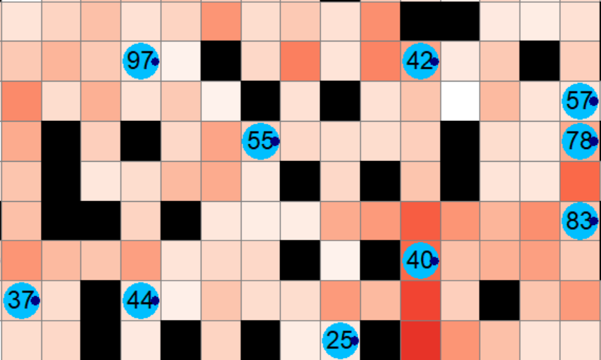

# Sub-optimality Heat-map

---

## 1  Enabling the Heat-map

| Control                                     | Description                                                                                                                     |
| ------------------------------------------- | -------------------------------------------------------------------------------------------------------------------------------- |
| **Heatmap mode** *(combo box)*             | Chooses **Off**, **Environmental static**, **Environmental dynamic**, **Agent static**, or **Agent dynamic**.                     |
| **Heatmap Stats** *(button)*                | Opens a pop-up window with summary statistics (mean, max, standard deviation, and breakdown by sub-optimality type).             |
| **Heatmap metric** *(combo box)*            | Focuses environmental cells or agent colours on *Total suboptimal movement*, *Wrong-direction count*, *Wait count*, or *Turn count*. |
| **Dynamic start** *(entry + button)*        | Shown only in dynamic modes; sets the first timestep included by dynamic modes.                                                  |

---

## 2  Colour Scale

* Each cell stores an integer **suboptimal movement score**.
  Higher values correspond to hotter colours.
* Colour ramps are auto-normalised unless you start PlanViz with `--heatmap_max <N>`, in which case `N` sets an absolute ceiling.

---

## 3  Underlying Algorithm
For every agent time‑step it compares the agent’s action to a distance oracle 
that estimates remaining path length to the current goal:

Progress check – If the agent fails to reduce its distance to the goal it adds to the suboptimal movement score:
+1 when it remains at the same distance (wait or lateral step)
+2 when it increases the distance (moves “backwards”)

The score is added to the grid‑cell the agent occupies, producing an environment‑level heat‑map of sub‑optimal behaviour.

The score is also added to agent based trackers, allowing the user to colour agents by their own suboptimal movement totals or breakdown counts.

Rotation assessment – When the action is a turn, the algorithm emulates three one‑step futures (no‑turn, clockwise+forward, counter‑clockwise+forward).
A rotation counts as suboptimal movement (+1) if moving straight would already reduce the distance to the goal, or if the opposite turn would lead to a shorter future distance than the turn actually taken.

* Distance heuristic chosen via `--pathalg` argument in `run.py`:
  * **Auto** – Automatically choose the best tractable heuristic based on grid size
  * **True** – exact shortest-path distances (Dijkstra).  
  * **Landmark** – ALT-style landmark heuristic.  
  * **Manhattan** – fast grid heuristic.

### Environmental Static Map

* Constructed once when the plan is loaded (`PlanConfig2024.load_subop_map`).
* Each sub-optimality metric is tracked separately:
  1. **Total suboptimal movement** – weighted score across all suboptimal movement types.
  2. **Wrong-direction count** – a step increases the heuristic distance to the goal.
  3. **Wait count** – the agent remains in the same cell without turning.
  4. **Turn count** – an unnecessary turn or a turn that does not re-orient the agent toward progress.
* Static and dynamic heatmaps share these metric definitions.

### Environmental Dynamic Map

* Updated every timestep by `PlanConfig2024.update_dynamic_subop_map()`.
* Computed from the **Dynamic start** value to the current timestep.

* Suboptimal movement score rules (per agent, per timestep):
  * **+2** if the next position is farther from the goal than the current one.
  * **+1** for `Wait` actions or unnecessary turns.

### Agent Static / Agent Dynamic

* Colours agent objects instead of grid cells.
* **Agent static** uses the full-plan static agent scores.
* **Agent dynamic** uses the same **Dynamic start** to current timestep range as Environmental dynamic.
* The selected **Heatmap metric** controls which per-agent score is shown.

## Heatmap Stats
* Computed in (`PlanConfig2024.compute_heatmap_stats`)

| Field                               | Meaning                                                                                |
| ----------------------------------- |----------------------------------------------------------------------------------------|
| **Non-zero cells**                  | Number of grid squares that have recorded any suboptimal movement.                     |
| **Total suboptimal movement**       | Sum of all cell values.                                                                |
| **Mean / Std dev**                  | Mean/STD of grid cell centric suboptimalities   Computed over non-zero cells only. |
| **Min / Max**                       | Lowest and highest non-zero cell values.                                               |
| **Wrong-direction count / Wait count / Turn count** | Global counters for each suboptimal movement type.                                     |
| **Mean / Std per agent**            | Mean/STD of agent centric suboptimalities                                              |
