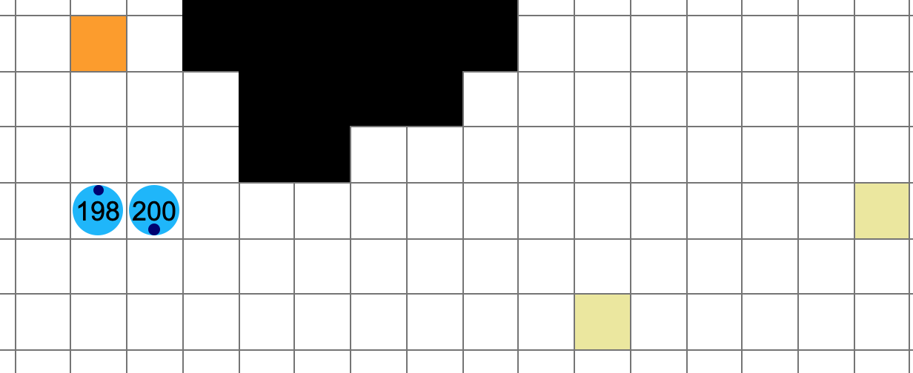
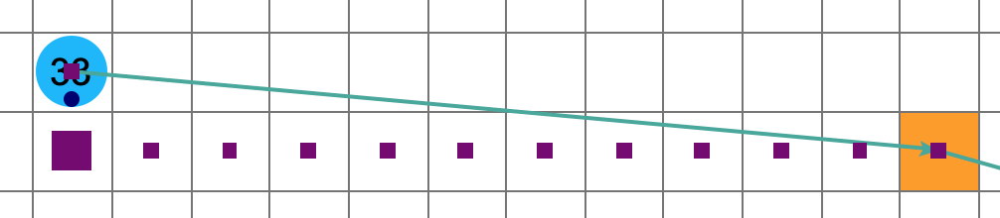
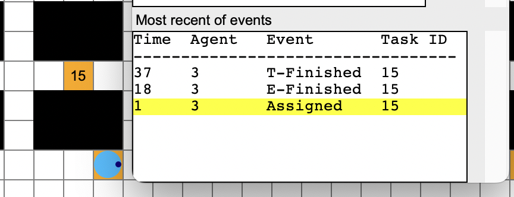

# PlanViz
The primary purpose of PlanViz is to help participants in the [League of Robot Runners competition](https://leagueofrobotrunners.org) better understand the planned paths and executed commands of their robots. PlanViz offers insights into problem solving strategies, by showing how robots move across the map, and by highlighting and exploring the errors and events given by the competition [Start-Kit](https://github.com/MAPF-Competition/Start-Kit). 

Being an offline tool, PlanViz takes as input a grid map (part of the competition problem set) and a [`JSON` formatted log file](https://github.com/MAPF-Competition/Start-Kit/blob/main/Input_Output_Format.md), which is produced by the the competition Start-Kit. The log file describes the planned and executed actions of agents at each timestep and renders the result. An example of the application in action is shown in the following video.


## Visual Markers

PlanViz provides a variety of visual markers to help users understand the results of their planning strategies.



- The map is plotted in grids with the white ones being the free spaces and black ones being obstacles.
- An agent is plotted in a blue circle, with a number being the agent index and a darkblue dot being its heading.
- All errands of tasks are represented by colored squares. Errands for a task are initially marked in yellow, turn orange when the task is assigned to an agent, and turn to white once the errand is completed and there is no further errand at this location.



- Right-click an agent to see/hide its path. The paths are presented with a sequence of purple squares, with the locations where the agent rotates or waits being larger.
- Right-clicking on non-agent grids will cancel all agents selections.



- Ctrl + Right-click an errand will show all related events
- Right-clicking on white grids will cancel selection.


## UI Options and Controls

The user interface supports a variety of operations to control and focus the display of plans.

- `Timestep` shows the current timestep.
- The buttons controls the progress of the plan/execution:
  - `Play`: Auto-play the plan/execution
  - `Pause`: Pause the scenario to the current timestep
  - `Fullsize`: Reset the scenario to fullsize
  - `Next`: Move the scenario to the next timestep
  - `Prev`: Move the scenario to the previous timestep
  - `Restart`: Reset the scenario to timestep 0
- The checkbox controls what to be shown in the scenario.
- `Start timestep`: Input the desire start timestep and move the scenario to.
- `List of errors` contains collisions and timeout issues from the Start-Kit. When the scenario is paused, you can double-click an error to see the invalid movements.
- A vertex/edge collision between agents $a_i$ and $a_j$ at location $V$/edge $(U,V)$ at timestep $T$ is presented under the format of `ai, aj, v=V/e=(U,V), t=T`. Single-click the collision in `List of errors` can mark the colliding agents in red, and press `ctrl` while clicking to select multiple collisions. See agents 19 and 22 in the following figure for example.
- `Most recent events` contains information of task assignments, errands completion and task completion. When the scenario is paused, you can *double-click* an event to move all the agents to the timestep when such event occurs.

## Arguments

- `--map` (type: *str*): Path to the map file (ends with `.map`). See `example/warehouse-small.map` for more information.
- `--plan` (type: *str*): Path to the planned path file (ends with `.json`). See `example/warehouse-small-60.json` for more information.
- `--n` (type: *int*): Number of agents need to show, starting from index 0 (*default*: All agents in the path file).
- `--grid`: Whether to show the grids on the map. Set to True if specified.
- `--aid`: Whether to show the agent indices. Set to True if specified.
- `--tid`: Whether to show the task indices. Set to True if specified.
- `--static`: Whether to show the start locations. Set to True if specified.
- `--ca`: Whether to mark all the colliding agents in red. Set to True if specified.
- `--ppm` (type: *int*):  Number of pixels per move, depending on the size of the map.
- `--mv` (type: *int*):  Number of moves per timestep; the tile size of the map is `ppm` $\times$ `mv`.
- `--delay` (type: *float*):  Wait time for each timestep after agents' movements.
- `--start` (type: *int*): Start timestep for visualization (*default*: 0).
- `--end` (type: *int*): End timestep for visualization (*default*: 100).
- `--hm` (type: *List[str]*): A list of path files (ends with `.json`) for generating heatmap.

If one is using [our maps](https://github.com/MAPF-Competition/benchmark_problems),
then we have default values for `ppm`, `mv`, and `delay`, so the user does not need to specify them.

## Run

To run PlanViz, open a terminal under the directory `PlanViz/` and type the following example command:

```bash
python script/run.py --map example/warehouse_small.map --plan example/warehouse_small_2024.json --grid --aid --ca --version "2024 LoRR"
```

Please keep in mind the formats of `JSON` files are different between 2023 and 2024.
