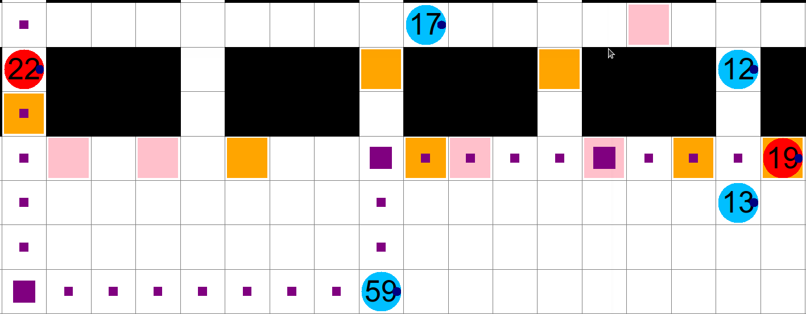

# PlanViz
Welcome to PlanViz! This is an **offline** visualization tool for analysing solutions to multi-robot and multi-agent coordination problems. It is developed as a support tool for participants in the [League of Robot Runners](http://leagueofrobotrunners.org) competition, however it can also be used for a variety of similar problems which are outside the scope of the competition. 

The primary purpose of PlanViz is to better understand how agents move across the map and to offer insights into the errors and events given by the competition [Start-Kit](https://github.com/MAPF-Competition/Start-Kit). Being an offline tool, PlanViz takes as input a grid map and a log file (in `JSON` format) produced by the the competition Start-Kit. The log file describes the planned and executed actions of agents at each timestep and renders the result with [`tkinter`](https://docs.python.org/3/library/tkinter.html), a pyton interface for the Tcl/Tk GUI toolkit. An example of the application in action is shown in the following video.


## Visual markers
- Agents are in blue circle, with a darkblue dot representing their headings. 
- The largest squares in the scenario are the tasks, which are initially marked in orange. Each task turns pink when it is assigned to an agent and grey when is completed.
- `List of errors` contains collisions and timeout issues from the Start-Kit. Double-click an error to move all the agents to one timestep before such error occurs.
- A vertex/edge collision between agents $a_i$ and $a_j$ at location $V$/edge $(U,V)$ at timestep $T$ is presented under the format of `ai, aj, v=V/e=(U,V), t=T`. Single-click the collision in `List of errors` can mark the colliding agents in red, and press `ctrl` while clicking to select multiple collisions. See agents 19 and 22 in the following figure for example.
- `List of events` contains information of task assignments and task completion. Double-click an event to move all the agents to one timestep before such event occurs.
- When PlanViz is in fullsize, right-click an agent to see/hide its path. The paths are presented with a sequence of purple squares, with the locations where the agent rotates or waits being larger.




## Arguments
- `--map` (type: *str*): Path to the map file (ends with `.map`). See `example/maze-32-32-2.map` for more details.
- `--plan` (type: *str*): Path to the planned path file (ends with `.path`). See `example/result.path` for more details.
- `--n` (type: *int*): Number of agents need to show (*default*: All agents in the path file)
- `--grid`: Whether to show the grids on the map. Set to True if specified.
- `--aid`: Whether to show the agent indices. Set to True if specified.
- `--tid`: Whether to show the task indices. Set to True if specified.
- `--static`: Whether to show the start locations. Set to True if specified.
- `--ca`: Whether to mark all the colliding agents in red. Set to True if specified.
- `--ppm` (type: *int*):  Number of pixels per move, depending on the size of the map
- `--mv` (type: *int*):  Number of moves per timestep; the tile size of the map is `ppm` $\times$ `mv`.
- `--delay` (type: *float*):  Wait time for each timestep

If one is using [our maps](https://github.com/MAPF-Competition/benchmark_problems),
then we have default values for `ppm`, `mv`, and `delay`, so the user does not need to specify them.

## Run
To run PlanViz, open a terminal under the directory `MAPF_analysis/visualizer and type the following example command:
```bash
python plan_viz.py --map ./warehouse-small.map --plan ./warehouse-small-60.json --grid --aid --static --ca
```
