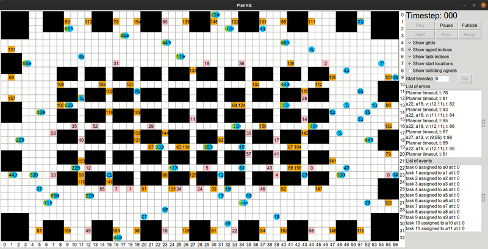

# PlanViz
Welcome to PlanViz! This is an **offline** (i.e., post-hoc) visualiser for analysing solutions to multi-robot and multi-agent coordination problems.
It is developed as a support tool for participants in the [League of Robot Runners](http://leagueofrobotrunners.org) competition.
However, PlanViz can also be used for a variety of similar problems which are outside the scope of the competition. 

PlanViz is implemented in python using the [`tkinter`](https://docs.python.org/3/library/tkinter.html), a Tcl/Tk GUI toolkit. An example of the application in action is shown in the following video.




## Run
Please refer to the [PlanViz instruction manual](./PlanViz.md) for details about how to use this tool and supported features. The following simple example shows how to visualise a plan file, from the JSON formatted descriptions produced by the Robot Runners start-kit.

Open a terminal and type the following command:
```bash
python3 script/plan_viz.py --map example/warehouse_small.map --plan example/warehouse_small.json --grid --aid --static --ca
```

# Tracker Transfer
Tracker Transfer is a tool that helps to convert best-known solutions to a wide range of MAPF problems, as published by the community website [MAPF Tracker](http://tracker.pathfinding.ai/). Once converted, these plans can be visualised with PlanViz. 


## Run
Please refer to the [Tracker Transfer instruction manual](./Tracker%20Transfer.md) for details about how to use this tool and supported features. The following example show how to use Tracker Transfer to convert a single plan, from the CSV formatted output of the MAPF Tracker, to the JSON format of PlanViz:

Open a terminal and type the following command:
```bash
python3 script/tracker_transfer.py --plan example/random-32-32-20_random_1_300.csv --scen example/random-32-32-20-random-1.scen --outputFile example/transfer_result
```
The MAPF Tracker also supports exporting multiple plans at the same time, from a bulk export CSV file (downloadable [here](http://tracker.pathfinding.ai/results/)) to multiple PlanViz output files. To learn more about this feature please refer to the instruction manual.
