# PlanViz Qt

**An interactive, offline viewer for multi-agent plans and execution logs, built with PySide6.**

Replay agents on a grid map, inspect their next errands, investigate recorded
errors, and compare task progress over time. PlanViz Qt supports **LoRR 2023,
2024 and 2026**, both **MAPF and MAPF_T**, and a common PlanViz JSON format for
other input converters. It reads existing results; it does not run a planner.

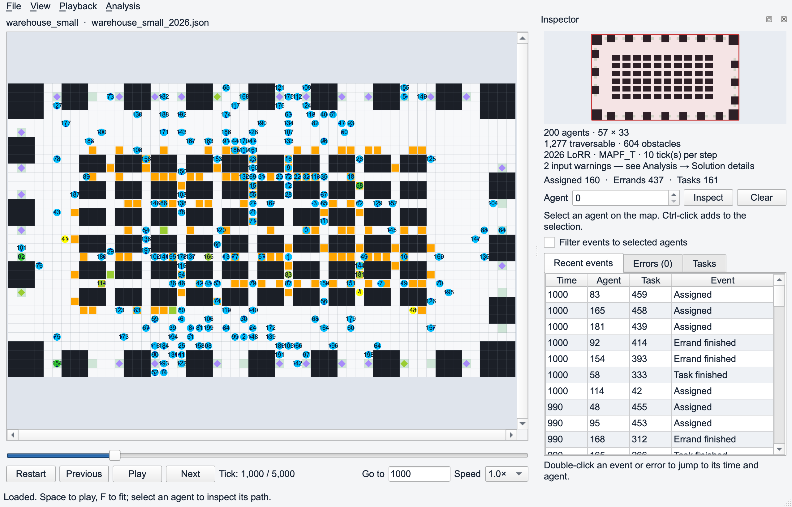

*The 2026 warehouse example at tick 1,000. The map, counters, task states, and
recent events share one playback time.*

This is the guide for the independent application in `qt/`. The original
Tkinter viewer and its [manual](../PlanViz.md) remain available in the parent
repository. Screenshots below are captures of the actual Qt widgets using
repository examples, Fusion styling, and 2× pixel density. Window decorations,
fonts, and menu placement can differ on your desktop.

## Contents

- [Install and run](#install-and-run)
- [Open a map and solution](#open-a-map-and-solution)
- [Supported formats and movement models](#supported-formats-and-movement-models)
- [Workspace and menus](#workspace-and-menus)
- [Playback and timing](#playback-and-timing)
- [Navigate the map](#navigate-the-map)
- [Select agents and inspect paths](#select-agents-and-inspect-paths)
- [Visual settings](#visual-settings)
- [Tasks and errands](#tasks-and-errands)
- [Colors and legend](#colors-and-legend)
- [Events and recorded errors](#events-and-recorded-errors)
- [Productivity](#productivity)
- [Solution details](#solution-details)
- [Analysis overlays](#analysis-overlays)
- [Export and conversion](#export-and-conversion)
- [Command-line reference](#command-line-reference)
- [Troubleshooting and limitations](#troubleshooting-and-limitations)
- [Development and documentation](#development-and-documentation)

## Install and run

Use **Python 3.10 or newer**. All commands in this guide run from the repository
root, the directory containing `qt/`, `script/`, and `example/`.

### Create an environment

On macOS or Linux:

```sh
python3 -m venv .venv
source .venv/bin/activate
```

On Windows PowerShell:

```powershell
python -m venv .venv
.\.venv\Scripts\Activate.ps1
```

Use an existing environment if you already have one. Install the Qt application's
dependencies and open the supplied warehouse example:

```sh
python -m pip install -r qt/requirements.txt
python qt/run.py --map example/warehouse_small.map --plan example/warehouse_small_2026.json
```

Run without arguments to open an empty workspace, then choose **File → Open…**:

```sh
python qt/run.py
```

The application uses PySide6, NumPy, Matplotlib, and PyYAML. It does not import the
original Tkinter application or require its Numba, pandas, SciPy, or Pillow stack.

### Optional package installation

The `qt/` directory is an independent installable Python project:

```sh
python -m pip install -e ./qt
planviz-qt --map example/warehouse_small.map --plan example/warehouse_small_2024.json
planviz-convert --help
```

After installation, `planviz-qt` and `python -m planviz_qt` are alternatives to
`python qt/run.py`. Example files are in this repository, not bundled in the
installed package; use paths to your own files when launching elsewhere.

## Open a map and solution

Choose **File → Open…** or press **Ctrl+O** (**Command+O** on macOS).

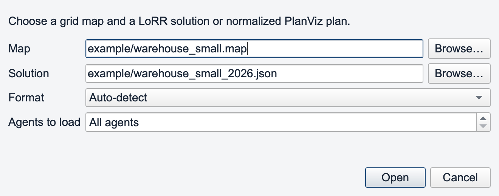

1. Select a `.map` file with **Browse…** next to **Map**.
2. Select a LoRR solution or normalized PlanViz `.json` file.
3. Leave **Format** at **Auto-detect**, or choose the source converter explicitly.
4. Leave **Agents to load** at **All agents**, or load the first N agents.
5. Choose **Open**. Progress messages appear in the status bar.

**Cancel loading** stops conversion cooperatively. Reading the JSON itself may
finish before cancellation takes effect. A failed load leaves the previously
loaded solution available. Opening another plan resets its playback range and
selection; visual settings remain selected within the same main window.

The map reader expects an octile header with matching positive width and height.
It supports `@` and `T` obstacles, `.` and `S` traversable cells, and `E` endpoint
cells. Coordinates use **zero-based row and column**. Supply the map associated
with the solution; the solution is not a substitute for the map file.
Dark map cells are obstacles, pale cells are traversable, and the pale green
terrain marks `E` endpoint cells independently of task markers.

## Supported formats and movement models

### Input converters

| Format | Converter identifier | Movement models | Timeline |
| --- | --- | --- | --- |
| LoRR 2023 | `lorr-2023` | MAPF, MAPF_T | Discrete timesteps |
| LoRR 2024 | `lorr-2024` | MAPF, MAPF_T | Discrete timesteps; sequential task errands |
| LoRR 2026 | `lorr-2026` | MAPF, MAPF_T | Ticks; segmented RLE actions and recorded delays |
| Normalized PlanViz JSON | `planviz` | MAPF, MAPF_T | Explicit source time unit and ticks per step |

The source's `actionModel` selects the movement model. There is no separate GUI
switch that reinterprets a loaded trajectory. List available converters with:

```sh
python qt/run.py --list-formats
```

Auto-detection uses the document's tags and structure. For ambiguous or untagged
inputs, select **Format** or pass `--format lorr-2024`, for example. The legacy
`--version "2024 LoRR"` override is also available and must agree with `--format`.

Map files use the supported `.map` syntax; an arbitrary planner's JSON is not
automatically supported because it uses a MovingAI map. Additional MovingAI
result adapters are deferred. For another producer, write the common JSON format
or follow the [converter development guide](src/planviz_qt/converters/README.md).

### MAPF versus MAPF_T

| Property | MAPF | MAPF_T |
| --- | --- | --- |
| Motion | Move along the grid axes without turning first | Move forward in the current heading |
| Actions | `U`, `D`, `L`, `R` | `F`: forward; `R`: clockwise; `C`: counter-clockwise |
| Orientation | Does not constrain translation | A 90° turn changes heading without changing position |
| Stationary actions | `W`: wait; `T`: task service | Same |

In the preserved LoRR convention, MAPF `U` **increases row** (down on screen),
`D` **decreases row**, `L` decreases column, and `R` increases column. Converters
from another axis convention must translate accordingly. The same `R` character
means **rightward movement in MAPF** and **clockwise rotation in MAPF_T**.

Movement model and time resolution are independent: both models support tick
motion in 2026. See the [common format specification](src/planviz_qt/converters/FORMAT.md)
for exact coordinates, action semantics, and prediction rules.

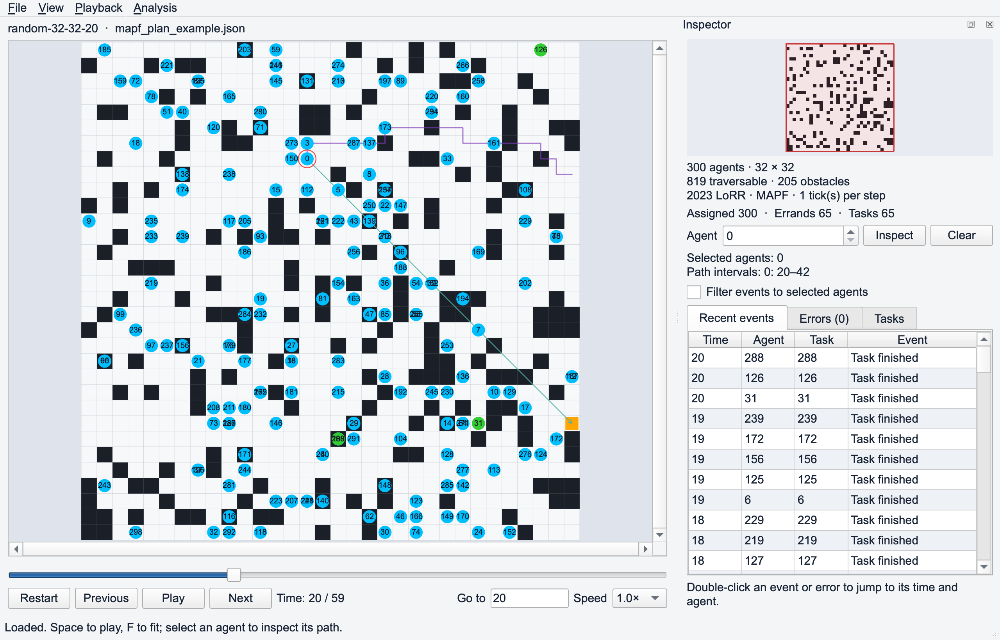

*`mapf_plan_example.json`, timestep 20, with agent 0 selected. This fixture uses
MAPF translation without heading-based turns.*

```sh
python qt/run.py --map example/random-32-32-20.map --plan example/mapf_plan_example.json
```

## Workspace and menus

The **map** is the central view. The **timeline** beneath it controls time and
speed. The dockable **Inspector** contains the minimap, loaded-solution summary,
cumulative counters, agent selector, and **Recent events / Errors / Tasks** tabs.
The **status bar** shows loading feedback and map coordinates while hovering.

| Menu | Commands |
| --- | --- |
| File | Open, export normalized plan, export viewport image, close |
| View | Fit map, Visual settings, Colors & legend, imported Analysis overlays |
| Playback | Play/pause, Previous, Next, Restart |
| Analysis | Productivity, Solution details |

Commands use one `QMenuBar`. macOS normally places it in the system menu bar;
Windows and Linux normally show it in the application window. The screenshots
use an in-window menu for portability. There is no duplicate main-window toolbar.
The Productivity chart has its own plotting toolbar.
Use **File → Close** or **Ctrl+W** / **Command+W** to close the application window.

## Playback and timing

| Control | Effect |
| --- | --- |
| Play / Pause, or Space | Start or stop automatic playback |
| Previous / Next, or Left / Right | Pause and move one logical tick or timestep |
| Restart, or Home | Pause and return to the active range's start |
| Timeline slider | Seek within the active range and pause |
| Go to + Enter | Seek to a whole tick/timestep, clamped to the active range |
| Speed | Change the playback multiplier |

At **1.0×**, tick plans advance at **10 ticks per second** and legacy timestep
plans advance at **5 timesteps per second**. Available speed choices are
`0.25×`, `0.5×`, `0.75×`, `1.0×`, `1.25×`, `1.5×`, `1.75×`, `2×`, `3×`, and `4×`.
For a tick plan, `0.5×` means 5 ticks/s and `1.25×` means 12.5 ticks/s.

Three settings describe different things:

| Setting | Meaning |
| --- | --- |
| `agentMaxCounter` / ticks per step | Source time needed for one cell move or 90° turn |
| Speed / `--speed` | Rate at which replay time advances |
| `--fps` | Target render callback rate; 60 by default |

For example, a 10-tick move takes one playback second at 1.0×. Changing `--fps`
does not change that speed. Positions and headings interpolate between logical
states, while event counts and status colors correspond to the integer time.
Playback follows elapsed wall time; if drawing falls behind, some display frames
may be skipped. Previous/Next lets you inspect every discrete state.

Use `--start` and `--end` to choose a replay interval at launch. These limit
playback, not the stored timeline. Restart returns to `--start`; opening another
plan through the dialog restores its full range.

## Navigate the map

| Interaction | Result |
| --- | --- |
| Wheel / vertical trackpad scroll | Zoom around the pointer |
| Trackpad pinch | Zoom on platforms delivering a native zoom gesture |
| `+` / `-` with map focus | Zoom around the viewport center |
| Left- or middle-button drag | Pan |
| Scrollbars / Alt+arrow keys with map focus | Pan |
| F or View → Fit map | Fit the entire map |
| Click or drag in the minimap | Center the main viewport on that region |
| Agent number + Inspect | Select and center on that agent |

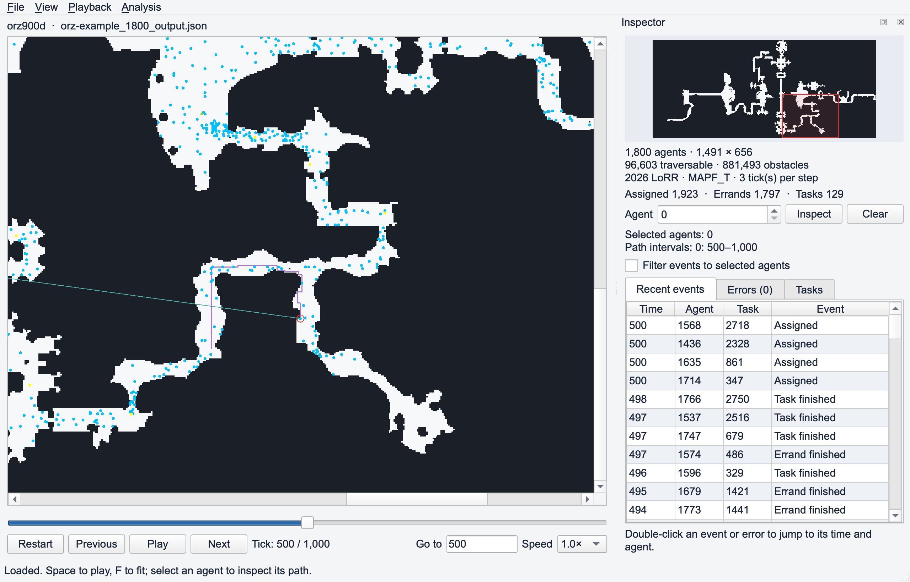

*The 1,800-agent `orz900d` example at tick 500. The red minimap rectangle identifies
the visible region; agent IDs are disabled for this dense overview.*

The minimap is a map overview and camera control, not a second detailed rendering
of all markers. Grid lines and heading dots are omitted at very small scales.
Enabled agent and task IDs remain visible at every zoom, so zoom in or disable
IDs when labels overlap.

## Select agents and inspect paths

Click or right-click an agent to select it. **Ctrl-click** (**Command-click** on
macOS) adds or removes an agent from a multiple selection. Alternatively, enter
an ID in Inspector and choose **Inspect**, which also centers the map.

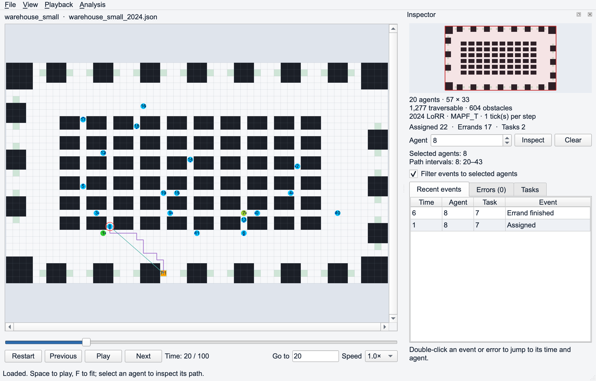

*The 2024 warehouse example at timestep 20. Agent 8's displayed interval is 20–43,
ending at task 7's next stop. Inspector filters the events to this agent.*

A newly selected agent gets a brief expanding, fading **red ring**. A persistent
red outline remains after the animation. Selection does not change playback
time or speed.

| Visual | Meaning |
| --- | --- |
| Purple polyline | Selected agent's recorded route over the displayed interval |
| Teal arrow | Direct pointer to the next unfinished errand |
| Inspector path interval | Exact source time interval used by the overlay |

Paths start **now** and stop at the next unfinished errand's arrival or relevant
recorded task boundary. The target advances when completion is recorded. The
preview is limited to **2,000 consecutive states** and the playback end; a distant
target can lie beyond that interval. Straight interior points are simplified
without drawing shortcuts across turns. This is a forward preview of recorded
execution, not a persistent trail of the entire past.

When an active assignment is missing, the next recorded completion may supply
the target. With no upcoming errand record, the viewer shows the bounded recorded
route. Inspector identifies these fallbacks; they do not invent ownership or
completion events. A stationary interval has no route line and is reported as
having no movement. The teal arrow indicates a target, not a traversable or
collision-free route.

Choose **Clear**, press **Escape** with map focus, or right-click empty space to
clear selection. **Show selected agent path** in Visual settings controls route
visibility. Selecting agents also limits displayed task markers to those agents;
filtering recent events is a separate checkbox.

### Actual and planned states

Enable **Show planned states** in Visual settings to display logged planner
predictions. At integer time `t > 0`, the predicted state starts at the **actual
state at `t − 1`** and applies the planned action for that interval. Predictions
do not accumulate into a separately simulated trajectory. The selected path uses
these predicted samples while this option is enabled; task and event records
still come from the source log.

## Visual settings

Open **View → Visual settings…** or press **Ctrl+,** / **Command+,**. Changes
apply immediately while the map remains interactive. Closing the settings window
keeps your choices; they also survive plan replacement in that main window.
They are not automatically saved across application restarts.

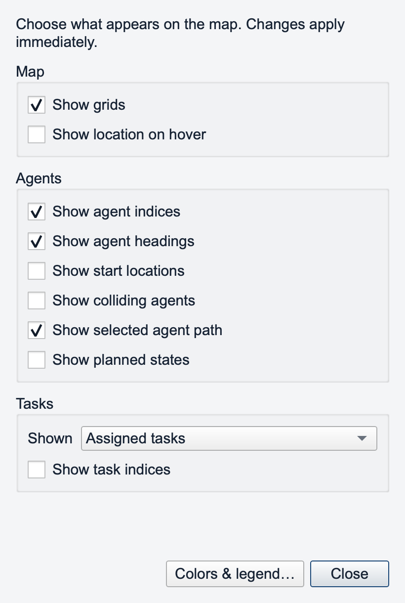

| Option | Default | Meaning |
| --- | --- | --- |
| Show grids | On | Draw cell boundaries when the zoom makes them useful |
| Show location on hover | Off | Show a row/column badge next to the pointer |
| Show agent indices | On | Draw numeric agent IDs at every zoom |
| Show agent headings | On | Draw orientation dots for states with a valid heading |
| Show start locations | Off | Draw translucent markers at initial agent positions |
| Show colliding agents | Off | Outline agents involved in recorded conflicts and color current conflicts |
| Show selected agent path | On | Display the selected agents' bounded route previews |
| Show planned states | Off | Display one-step planner predictions |
| Shown | Assigned tasks | Choose which task/errand markers appear |
| Show task indices | Off | Draw `task:errand` labels, with `*` for shared cells |

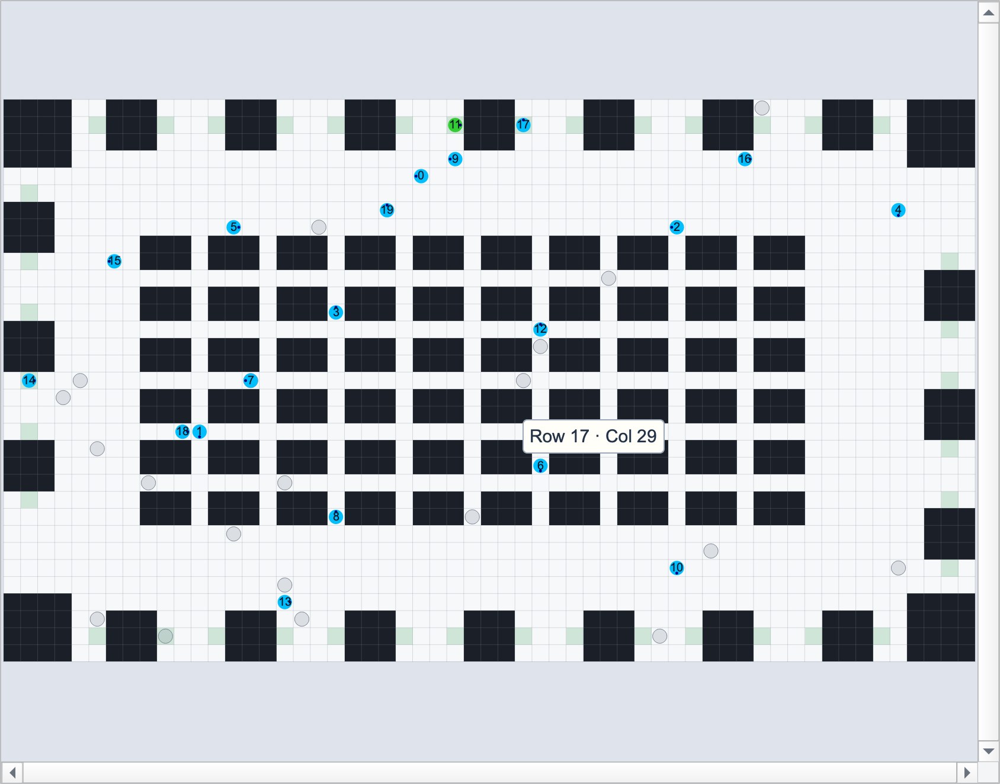

*Start locations remain fixed as agents move. The optional badge identifies the
hovered cell; the status bar also reports coordinates.*

The **Colors & legend…** button opens the palette guide without closing Visual
settings. Imported analysis layers have their own controls under **View →
Analysis overlays**.

## Tasks and errands

A task has an ordered sequence of stops. **Diamonds** represent intermediate
errands; the **square** is the task's final destination. A one-stop task has only
a square. Completion of the final stop counts as both an errand completion and a
task completion.

The **Shown** dropdown changes map markers:

| Mode | Markers shown |
| --- | --- |
| Next errand | First unfinished stop of each currently active assigned task |
| Assigned tasks | Remaining unfinished stops of currently active assigned tasks |
| All tasks | Stops of tasks released by the current time, including completed stops |
| Hidden | No task/errand markers or target arrows; the selected route can remain visible |

An agent selection restricts these markers by the recorded owner. Clear selection
to restore the full view. This does not filter the separate Tasks table.

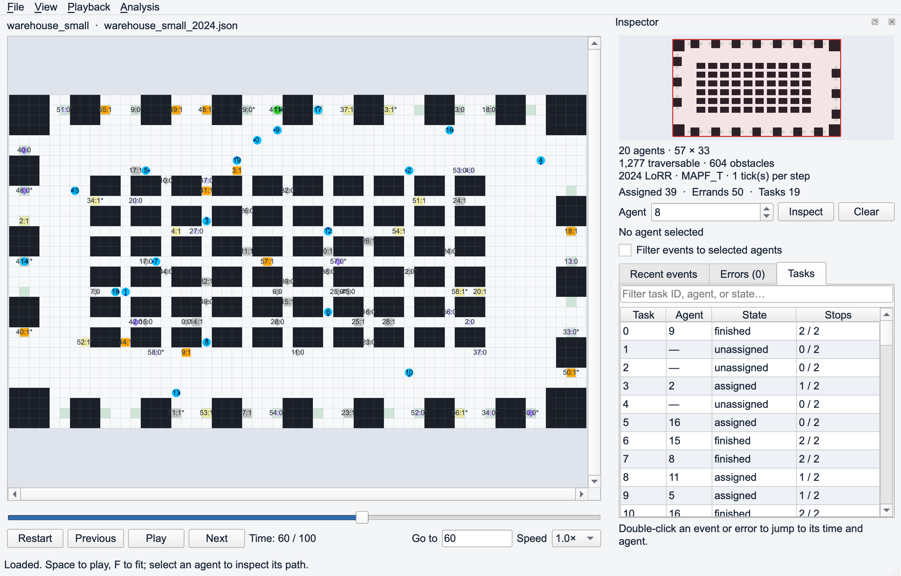

*The 2024 warehouse example at timestep 60, with All tasks and task indices
enabled. Gray markers indicate recorded completions.*

### Task labels and shared locations

Labels use **`task_id:stop_index`**, with a zero-based stop index. At an exact
shared location, the latest release time wins; ties use the highest task ID,
then highest stop index. A trailing **`*`**, such as `29:0*`, means multiple
distinct tasks share that cell within the current display filters. Repeated
stops of one task alone do not add `*`. All records remain in Inspector.

This resolves exact shared locations. Labels at neighboring cells can still
overlap when zoomed out.

### Tasks table

Inspector's **Tasks** tab lists task ID, recorded owner, current state, and
completed/total stops. The search box matches text across its columns, ignoring
case. It includes loaded task records even if the map's Shown mode hides them.

Double-click a task to inspect its current owner. If there is no current owner,
the viewer uses its first recorded assignment; without an assignment, it centers
on the first stop and filters events to that location. Table state follows the
playback cursor, including backward seeks. Resize column headers if values are
clipped.

## Colors and legend

Open **View → Colors & legend…**. Its **Agents**, **Tasks & errands**, and
**Paths & labels** tabs show the active colors, fixed shapes, and their meanings.

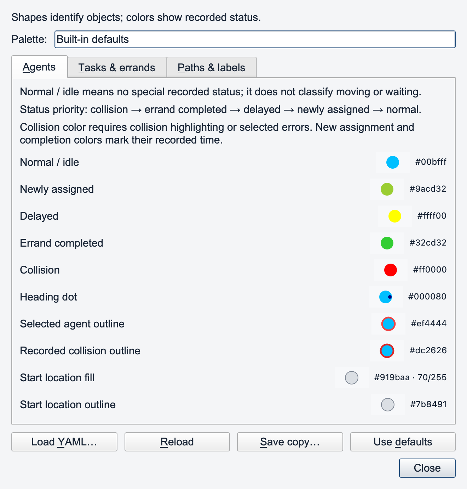

| Agent status | Default color | When it applies |
| --- | --- | --- |
| Normal / idle | Blue `#00bfff` | No special recorded status; includes moving agents |
| Newly assigned | Yellow-green `#9acd32` | At the recorded assignment time |
| Delayed | Yellow `#ffff00` | Within an inclusive recorded delay interval |
| Errand completed | Green `#32cd32` | At the recorded completion time |
| Collision | Red `#ff0000` | Current conflict when highlighting is enabled, or agents marked through error selection |

When statuses overlap, priority is **collision → errand completed → delayed →
newly assigned → normal**. A red selection outline is independent of collision
status; it does not mean that the agent collided.

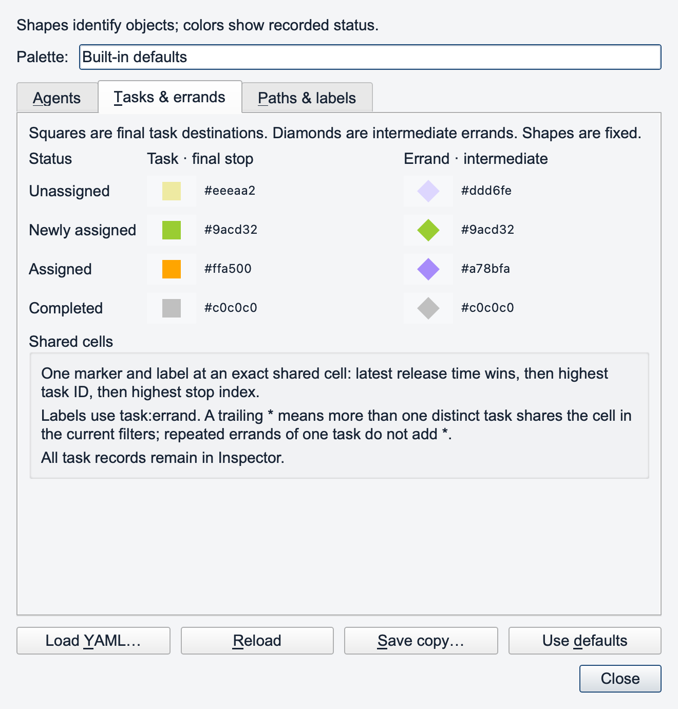

| Destination status | Final task square | Intermediate errand diamond |
| --- | --- | --- |
| Unassigned | Pale yellow `#eeeaa2` | Pale lavender `#ddd6fe` |
| Newly assigned | Yellow-green `#9acd32` | Yellow-green `#9acd32` |
| Assigned | Orange `#ffa500` | Purple `#a78bfa` |
| Completed | Gray `#c0c0c0` | Gray `#c0c0c0` |

### Customize the palette

Colors are defined in [Color_palette.yaml](src/planviz_qt/palettes/Color_palette.yaml).
Create a separate YAML file with only the overrides you need:

```yaml
version: 1
agent:
  idle: "#342353"
  selected_outline: "#ef4444"
task:
  assigned: "#f97316"
```

| Legend action | Behavior |
| --- | --- |
| Load YAML… | Load overrides and fill omitted colors from defaults |
| Reload | Reread the active YAML file after edits |
| Save copy… | Save the complete palette and make that file active |
| Use defaults | Restore bundled colors |

Palette changes preserve the loaded plan, playback position, and selection.
Use **Save copy → edit the file → Reload** for repeatable customization. Select
the same file on the next launch with `--palette my_palette.yaml`.

Colors must be quoted six-digit hexadecimal strings. Shapes, terrain/grid colors,
and analysis overlay scales are not configurable through this palette. See the
[complete palette guide](PALETTE.md) for all keys, opacity, validation, and the
Python API. Palette files are separate from exported plan JSON.

## Events and recorded errors

### Recent events

The **Recent events** tab shows time, agent, task, and event type. It contains
events up to the playback cursor, newest first, limited to 100 rows by default.
Change that limit with `--event-limit`.

- Double-click an event to seek to its time and select/center its agent.
- Enable **Filter events to selected agents** to inspect one or more agents.
- Click an empty map cell, or Ctrl/Command-right-click a cell, to filter events
  by that location. Right-click with a modifier performs location filtering,
  including when the cell contains an agent.
- Select an agent or choose **Clear** to reset the location filter.

The **Assigned**, **Errands**, and **Tasks** counters are cumulative totals for
the loaded records up to the current time. The event row limit and agent/location
filters do not change these counters. Counts are recomputed consistently when
seeking backward; starting a replay at a later time does not subtract its history.

### Errors and collision highlighting

The **Errors** tab lists recorded planner/schedule diagnostics across the loaded
timeline, including future errors. A diagnostic can have multiple agents or no
agent, such as an invalid planner result or timeout report.

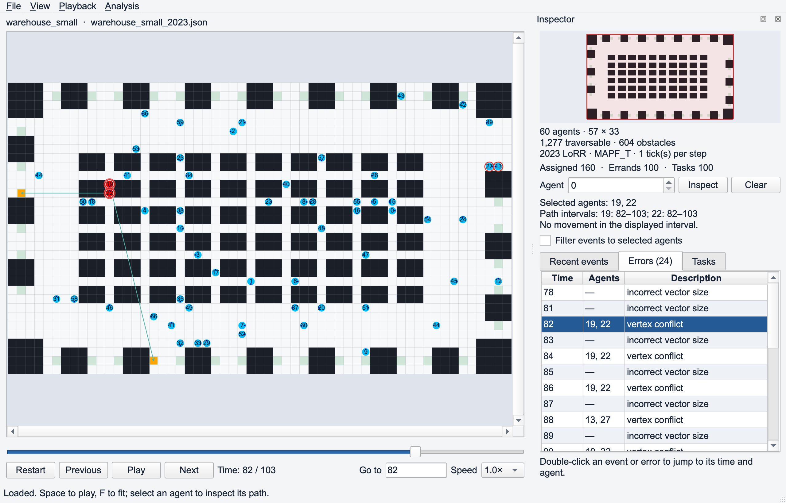

*The supplied 2023 warehouse log contains a vertex-conflict record at timestep
82 for agents 19 and 22. The screenshot displays that source diagnostic.*

Select error rows to mark their agents red; use Ctrl/Command-click for multiple
rows. Double-click a row to jump to its time and select its associated agents.
An error without agent IDs still supports jumping to its time.

**Show colliding agents** outlines agents that appear in recorded conflicts and
fills agents red when their conflict occurs at the current time. Manually marked
error agents remain highlighted until the error selection is cleared. These
displays use recorded diagnostics; **PlanViz does not independently detect every
collision or certify solution feasibility**.

## Productivity

Open **Analysis → Productivity…** to inspect performance over the recorded
timeline. The dashed cursor follows playback; the summary provides the current
value in text.

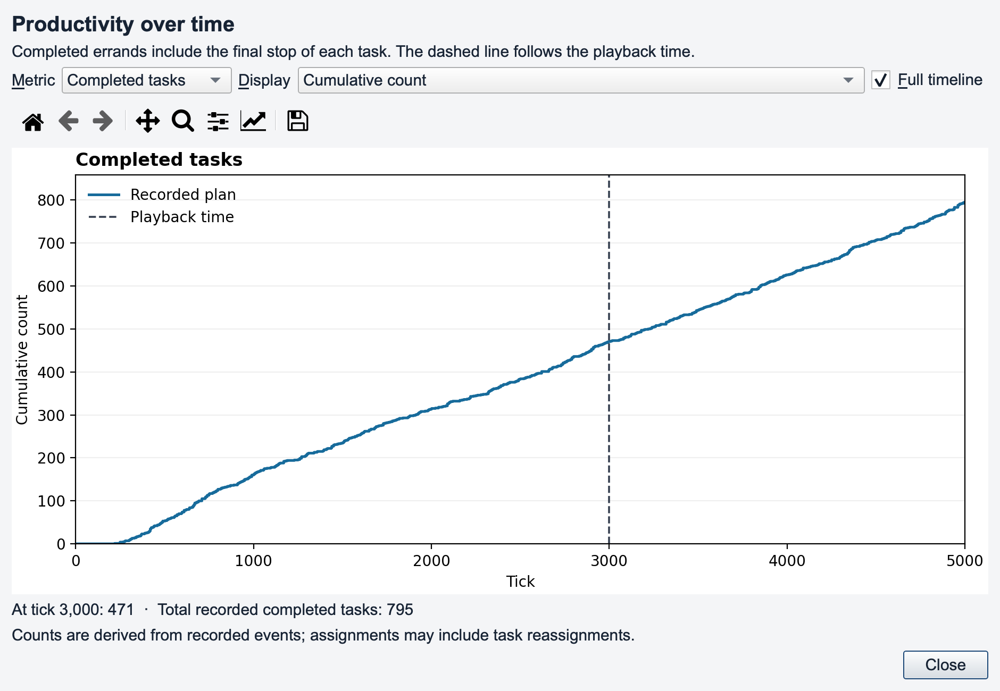

*The 2026 warehouse recording has 471 completed tasks by tick 3,000 and 795 over
the full recording. These values are computed from its event records.*

| Selector | Choices |
| --- | --- |
| Metric | Completed tasks, completed errands, task assignments |
| Display | Cumulative count, completions/assignments at each time, average throughput |
| Full timeline | Checked: whole recording; unchecked: active start through playback cursor |

The final stop counts as both an errand and a task completion. Assignment counts
can include reassignment. Average throughput is **cumulative count divided by
elapsed plan time since the displayed start**, with zero at that start. The
historical count is not subtracted for a nonzero start, preserving the original
viewer definition. Units are counts per tick or timestep, not per playback second.

Use the chart toolbar to pan, zoom, reset its view, or save a figure. This chart
summarizes the loaded recording; selecting an agent does not filter its series.

## Solution details

Open **Analysis → Solution details…** for a readable summary of the loaded input.

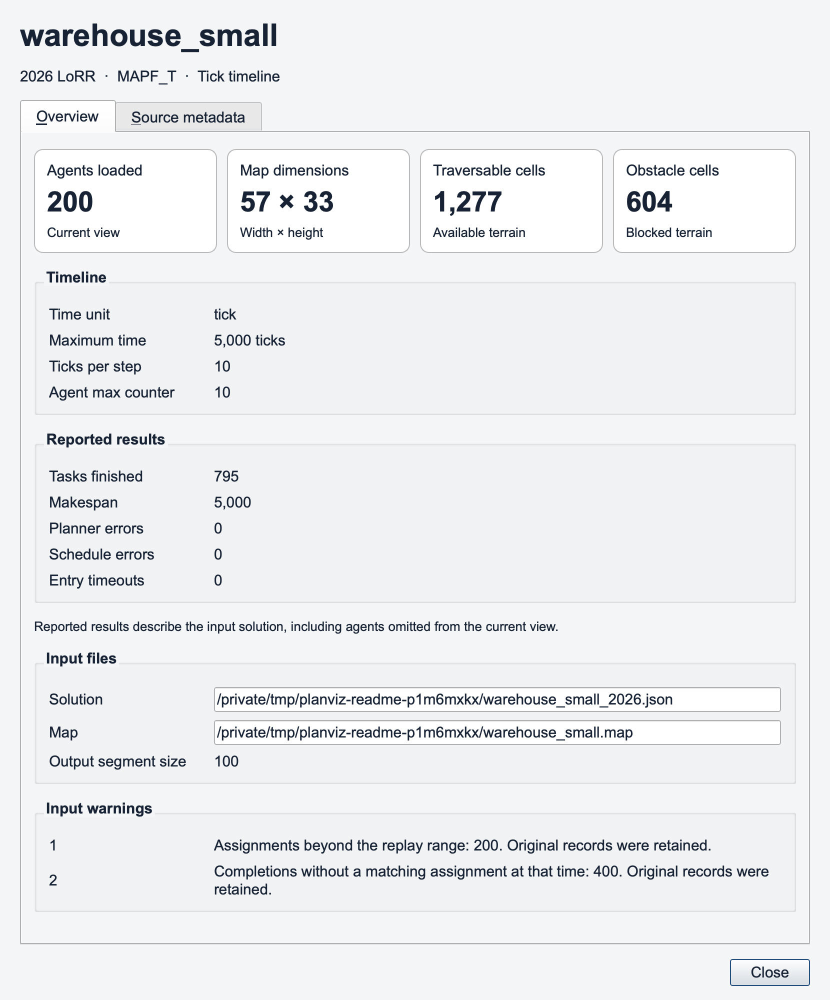

| Section | Information |
| --- | --- |
| Header | Map name, source version, movement model, time unit |
| Summary cards | Agents loaded, width × height, traversable cells, obstacle cells |
| Timeline | Maximum time, ticks per step, `agentMaxCounter` when supplied |
| Reported results | Tasks finished, makespan, planner errors, schedule errors, entry timeouts |
| Input files | Copyable map/solution paths and output segment size when supplied |
| Input warnings | Nonfatal inconsistencies retained for inspection |
| Source metadata tab | Expandable original metadata fields and collections |

Summary cards describe the loaded map and agent count. **Reported results retain
the input solution's scope**, including agents excluded with an agent limit.
An absent source field appears as **Not provided**, rather than an invented zero.

The warehouse screenshot includes genuine timestamp warnings from that fixture.
Malformed structure stops loading, while interpretable timing inconsistencies
remain visible without changing original records. See the
[input validation policy](VALIDATION_POLICY.md) for the exact boundary.

## Analysis overlays

Load optional analysis files at startup, then enable individual layers under
**View → Analysis overlays**. Layers are initially hidden and appear only when
supplied. Opening a different plan does not carry these layers over.

| Option | Layer | Supported input |
| --- | --- | --- |
| `--hm FILE [FILE ...]` | Traffic heatmap | LoRR execution JSON, coordinate-path text, or numeric grid |
| `--hw FILE` | Directed highways | Legacy encoded-edge text or explicit edge JSON |
| `--heu FILE` | Heuristic values | Grid/JSON values or legacy per-agent CSV |
| `--searchTree FILE [FILE ...]` | Search-tree locations | Legacy CSV with `loc` or supported JSON locations/grid |

```sh
python qt/run.py --map example/warehouse_small.map --plan example/warehouse_small_2024.json --hm example/warehouse_small_2024.json
```

Enable **View → Analysis overlays → warehouse_small_2024** after loading:

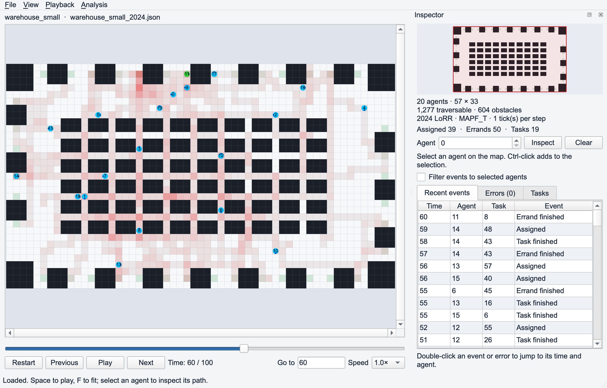

*Darker red indicates greater recorded traffic. Task markers are hidden in this
capture to make the overlay easier to see. The heatmap covers its source paths,
not only the time before the playback cursor.*

Multiple heatmaps also create a **Combined heatmap** sum. Heatmaps follow the
legacy sampling convention: terminal states and trailing literal `W` actions are
excluded, and fractional positions are mapped to their nearest cells. A traffic
heatmap is not a map of collision counts or planning difficulty.

Legacy heuristic CSV selects agent **104** by default; another agent can be
selected through the Python overlay API, not through a GUI selector. Raster
overlays must match the loaded map dimensions. Overlay loading errors are shown
as warnings while the main plan can still load. See the
[overlay reader](src/planviz_qt/io/overlays.py) for the full accepted formats.

## Export and conversion

### Export a map image

Choose **File → Export viewport image…** or **Ctrl+Shift+S** / **Command+Shift+S**.
The PNG contains the visible map and enabled scene layers at the current time
and zoom. It does not include the entire window, Inspector, or offscreen map
regions. Fit the map first to export the full map. Use the Productivity toolbar
separately for chart figures.

### Export normalized PlanViz JSON

Choose **File → Export normalized plan…** to save a common, versioned input for
the Qt viewer. The export preserves the **entire loaded timeline**, selected
load-time agent count, actual/planned semantics, task histories, events,
diagnostics, and compressed motion runs. The current selection, displayed
playback range, camera, and palette do not restrict this data export.

Convert without the GUI, after installing the package:

```sh
planviz-convert normalize --map example/warehouse_small.map --plan example/warehouse_small_2026.json --format lorr-2026 --output /tmp/planviz-normalized.json
planviz-qt --map example/warehouse_small.map --plan /tmp/planviz-normalized.json --format planviz
```

Use an output path appropriate for your system. A map file is still required
when reopening normalized JSON. See the [common JSON specification](src/planviz_qt/converters/FORMAT.md).

### Tracker and coordinate-path converters

Two standalone tools produce 2023-compatible logs accepted by both viewers:

```sh
planviz-convert tracker --plan example/random-32-32-20_random_1_300.csv --scen example/random-32-32-20-random-1.scen --output /tmp/tracker.json
planviz-convert paths --path /path/to/paths.txt --output /tmp/paths.json
```

The tracker converter reads path CSV with its scenario file. For a bulk tracker
CSV, use `--multi` and a scenario directory; output files receive numeric suffixes.
The paths converter reads coordinate-path text. Replace placeholder paths with
your files and use each subcommand's `--help` for its options.

Without package installation, run these commands as
`PYTHONPATH=qt/src python -m planviz_qt.converters ...` on macOS/Linux. On
PowerShell, set `$env:PYTHONPATH = "qt/src"` before `python -m planviz_qt.converters ...`.

## Command-line reference

```sh
python qt/run.py --help
```

| Argument | Default | Purpose |
| --- | --- | --- |
| `--map PATH` | None | Grid map; supply together with `--plan` |
| `--plan PATH` | None | LoRR or normalized PlanViz JSON |
| `--format ID` | `auto` | Choose an input converter |
| `--list-formats` | Off | Print available converters without importing Qt |
| `--version VERSION` | From detection | LoRR override: `2023 LoRR`, `2024 LoRR`, or `2026 LoRR` |
| `--n N` | All agents | Load agents 0 through N−1, up to the source count; N must be positive |
| `--start N` | `0` | First replay time; nonnegative |
| `--end N` | Recording end | Last replay time; at least start, clamped to the recording |
| `--speed X` | `1.0` | Positive finite playback multiplier; custom values join the selector |
| `--fps N` | `60` | Target render callback rate, from 1 through 240 |
| `--event-limit N` | `100` | Maximum recent-event rows; positive |
| `--grid [BOOL]` | `true` | Initial grid visibility |
| `--aid [BOOL]` | `true` | Initial agent-ID visibility |
| `--tid [BOOL]` | `false` | Initial task-label visibility |
| `--static` | Off | Initially show start locations |
| `--ca` | Off | Initially highlight recorded conflict agents |
| `--palette PATH` | Bundled defaults | YAML color overrides |
| `--hm FILE [FILE ...]` | None | Traffic heatmap sources |
| `--hw FILE` | None | Directed-highway source |
| `--heu FILE` | None | Heuristic-value source |
| `--searchTree FILE [FILE ...]` | None | Search-tree sources; preserve the flag's capitalization |
| `--inspect` | Off | Print loading/record statistics without importing Qt |
| `--help` | — | Print usage and exit |

Boolean options accept `true/false`, `yes/no`, `on/off`, or `1/0`; a bare `--tid`,
for example, enables task labels. `--static` and `--ca` are presence-only flags.

Replay a restricted range and the first 50 agents:

```sh
python qt/run.py --map example/warehouse_small.map --plan example/warehouse_small_2026.json --start 100 --end 2000 --n 50 --fps 60 --speed 0.5 --grid true --aid true --tid false --static
```

### Inspect a large input without a GUI

```sh
python qt/run.py --inspect --map example/LoRR2026/maps/scene_mp_2p_01.map --plan example/LoRR2026/outputs/iron-example_10000_output.json
```

`--inspect` reports model/version, agent and map size, time range, task/event/
conflict counts, cumulative counts, input warnings, compressed path storage,
elapsed loading time, and finite initial/middle/final snapshots. Storage bytes
cover the path store and populated snapshot cache, not total process memory.
This command inspects the main plan; it does not load optional analysis overlays.

## Troubleshooting and limitations

| Situation | What to check |
| --- | --- |
| No selected path appears | Select an agent, enable Show selected agent path, and read its Inspector interval. The interval may be stationary, already at its target, or at the replay end. |
| Task markers are missing | Check Shown, agent selection, task release time, and recorded assignments. Completed markers require All tasks. |
| Agent/task IDs overlap | Zoom in or disable IDs. Exact shared-task locations use `*`, but neighboring labels can still overlap. |
| A red outline appears without a collision | Selection also uses a red outline. Check the Errors tab and collision fill to distinguish the states. |
| Planned positions look discontinuous | They are one-step predictions from actual states, not an accumulated planner-only route. |
| An input warning appears | Open Solution details. Interpretable inconsistent records are preserved; warnings do not silently repair them. |
| Playback pauses briefly with many labels/tasks | Initial label-cache construction and large task transitions remain costly. Reduce shown layers or the loaded agent count; see measurements below. |
| A format is rejected | Choose the right converter, verify map dimensions and required fields, or normalize using a source-specific adapter. |
| Settings reset after restarting | Visual toggles are session choices. Use CLI options and a palette file for repeatable startup settings. |

The viewer supports invalid execution logs for diagnosis and does not certify
collision freedom, in-map motion, or solver correctness. A successful load or
finite snapshot is not a feasibility proof.

Large recordings use compressed runs, bounded snapshot/path caches, viewport
culling, batched drawing, and cached start/label rendering. These reduce overhead
but do not guarantee 60 FPS. See the [reproducible benchmark report](benchmarks/README.md)
for measurements, cache memory, cold-start costs, and remaining task-transition
latency. Native desktop presentation and Windows/Linux interactions need their
own release checks; offscreen tests do not establish those results.

### Differences from the Tkinter viewer

| Original control or visual | Qt equivalent |
| --- | --- |
| Fullsize | View → Fit map, or F |
| Always-visible display checkboxes | View → Visual settings |
| Metadata information icon | Analysis → Solution details |
| Per-state purple path squares | A bounded selected-route polyline from the current time |
| Uniform square errands | Diamonds for intermediate errands; squares for final task destinations |
| `--ppm`, `--mv`, `--delay`, `--window` | World-coordinate zoom, independent speed/render rate, compressed storage, and replay start/end |

The Qt application does not accept those four Tkinter-specific flags. Use the
original entry point if their exact behavior is required. Video/GIF recording is
not a built-in export command; the available exports are viewport PNG, chart
figures, and normalized plan JSON.

## Development and documentation

Application responsibilities are separated as follows:

```text
qt/
  run.py                       Source-checkout entry point
  pyproject.toml               Package metadata and console scripts
  src/planviz_qt/
    domain/                    GUI-free records, compressed paths, analytics,
                               selected-path service, record diagnostics
    converters/                Input adapters, common JSON, standalone tools
    io/                        File loading and analysis overlay readers
    application/               Worker lifecycle and wall-clock playback
    ui/                        Main window, map, minimap, tables, settings,
                               palette legend, solution details, productivity
    palettes/                  Bundled Color_palette.yaml
  docs/
    capture_screenshots.py      Reproduce this guide's real-widget captures
    images/                    PNG screenshots and fixture provenance manifest
  benchmarks/                  Reproducible replay measurements and results
  tests/                       Domain, converter, renderer and integration checks
```

Converters return common `PlanData` records. Analytics and path selection remain
independent of Qt; the main window connects them to playback and rendering. The
path store retains compressed runs rather than a dense agent-by-time history.
Selection reuses bounded blocks and geometry; the renderer batches agents and
caches labels with a text fallback when the raster budget is exhausted.

| Guide | Contents |
| --- | --- |
| [Converter development](src/planviz_qt/converters/README.md) | Implement, register, and test a new input converter |
| [Common JSON format](src/planviz_qt/converters/FORMAT.md) | Output schema, action semantics, and round trips |
| [Input validation policy](VALIDATION_POLICY.md) | Structural errors versus retained record warnings |
| [Palette guide](PALETTE.md) | All color keys, validation, opacity, and Python API |
| [Validation record](VALIDATION.md) | Historical checks and their scope |
| [Benchmarks](benchmarks/README.md) | Before/after measurements and reproduction |

Run the test suite from the repository root with GUI dependencies installed:

```sh
QT_QPA_PLATFORM=offscreen MPLCONFIGDIR=/tmp/planviz-qt-mpl PYTHONPATH=qt/src python -B -m unittest discover -s qt/tests -v
```

On PowerShell, set these environment variables with `$env:NAME = "value"` before
running `python -B -m unittest discover -s qt/tests -v`; choose a writable local
directory for `MPLCONFIGDIR`. Some fixture tests require the repository's
`example/` directory.

To regenerate this README's screenshots from the actual application:

```sh
python qt/docs/capture_screenshots.py
```

The capture script loads byte-identical temporary copies of repository examples,
uses the actual dialogs/renderers, and writes PNGs to `qt/docs/images/`. It sets
the offscreen platform itself and does not open desktop windows. The accompanying
[manifest](docs/images/manifest.json) records source checksums, replay times,
image dimensions, and capture method. It is documentation tooling, not an
additional application export feature.
